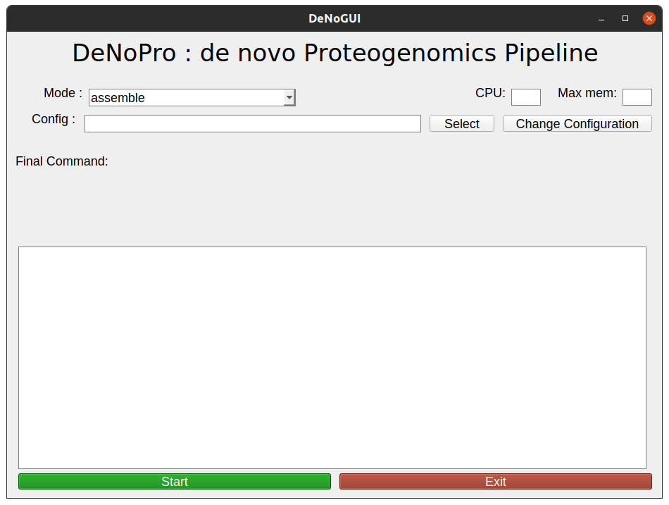
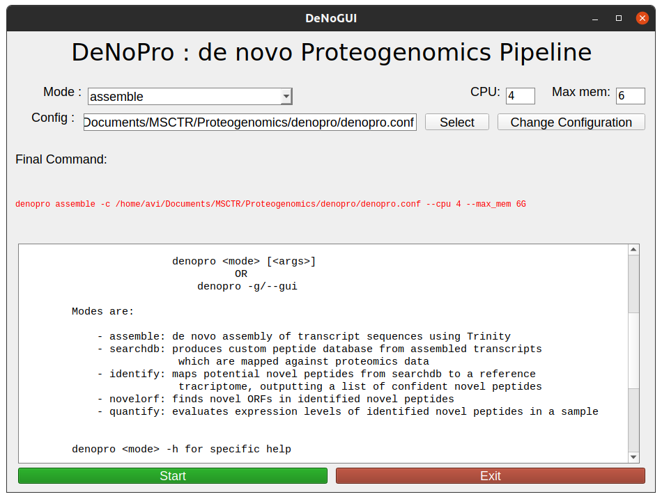
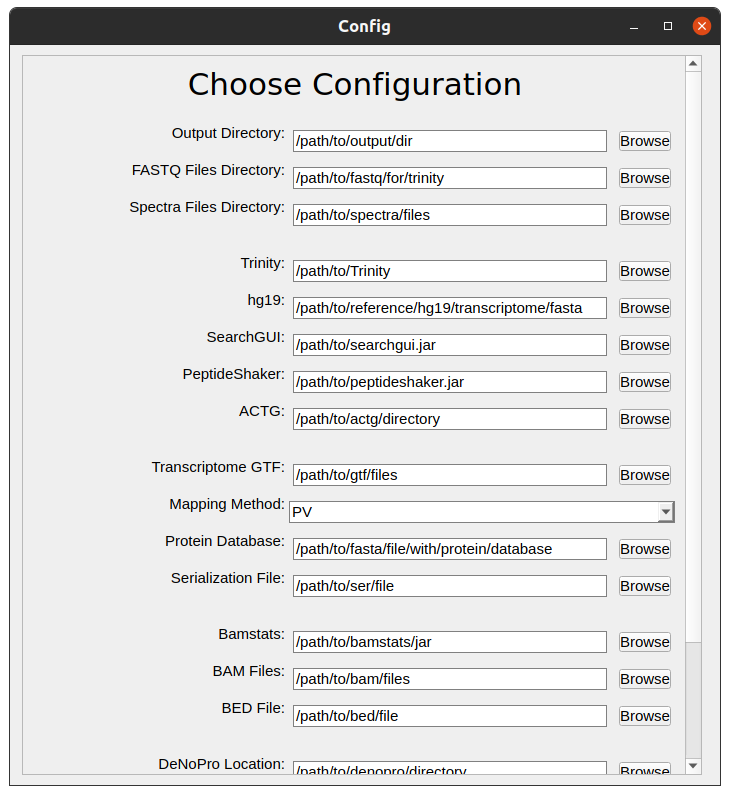

# DeNoPro

DeNoPro - a denovo proteogeomics pipeline to identify clinically relevent novel variants from RNAseq and Proteomics data.

## Contents ##
1. [Introduction](#introduction)
2. [Installation](#installation)
3. [Dependencies](#dependencies)
4. [Usage](#usage)
5. [GUI](#gui)


## Introduction
DeNoPro provides a pipeline for the identification of novel peptides from matched RNAseq and MS/MS proteomics data. 

The pipeline consists of de novo transcript assembly (Trinity), generation of a protein sequence database of 6-frame translated transcripts, and a combination of search engines (X! Tandem, MS-GF+, Tide) to query the custom database. Identified novel peptides and protein variants are then filtered by confidence and mapped to gene models using ACTG.  


## Installation
To install DeNoPro as a python module, open a terminal in the directory containing setup.py, and run
```
python setup.py install
```
DeNoPro can be made executable by running `chmod u+x denopro`.


## Dependencies

DeNoPro has been tested with Python 3, Python 2 is not supported at this time. R version 4.0.0 or greater is required to run the PGA package. 

We recommend using a conda environment to maintain dependencies, and an environment config file using Python 3.9.6 and R 4.0.5 has been provided. To setup the conda environment, run `conda env create -f denopro-env.yml` and activate with `conda activate denopro-env`.

### Required software

#### Included in conda environment
- [Trinity](https://github.com/trinityrnaseq/trinityrnaseq/wiki) version 2.8.5 - Used during `assemble` for de novo assembly of RNA transcripts 
- [PGA](https://github.com/wenbostar/PGA) (R>4.0) - Used in `customdb` for creation of 6-frame translated protein database 
- [PySimpleGUIQt](https://github.com/PySimpleGUI/PySimpleGUI/tree/master/PySimpleGUIQt) - Used to run the GUI functionality

#### Not included in conda environment
- [SearchGUI](https://compomics.github.io/projects/searchgui) version [3.3.17](https://mvnrepository.com/artifact/eu.isas.searchgui/SearchGUI/3.3.17) - Uses the `X! Tandem`, `MS_GF+` and `Tide` search engines to search created custom database against mgf spectra files
- [PeptideShaker](https://compomics.github.io/projects/peptide-shaker) version [1.16.42](https://mvnrepository.com/artifact/eu.isas.peptideshaker/PeptideShaker/1.16.42)    - Used to select matching identifications among the three search engines to output a list of confident novel peptides and their corresponding proteins
- [ACTG](https://academic.oup.com/bioinformatics/article/33/8/1218/2748210)     - Used to map identified confident novel peptides to their corresponding genomic locations
- [Bamstats](https://github.com/guigolab/bamstats) - Used to process expression levels of novel peptides 


## Usage

DeNoPro was designed to be modular, to account for large processing times. The modes are

`assemble` : de novo assembly of transcript sequences using Trinity

`searchdb` : produces custom peptide database from assembled transcripts which are mapped against proteomics data

`identify` : maps potential novel peptides from searchdb to a reference tracriptome outputting a list of confident novel peptides

`novelorf` : finds novel ORFs in identified novel peptides

`quantify` : evaluates expression levels of identified novel peptides in a sample

The standard workflow is 
    `assemble` >> `searchdb` >> `identify` >> `novelorf` >> `quantify`

### Assemble 
denovo assembly of transcript sequences using Trinity

```
denopro assemble [options]
```

#### CLI options
* `-c/--config_file`: Point to the path of config file to use. Default is `./denopro.conf`
* `--cpu`: Maximum number of threads to be used by Trinity
* `--max_mem`: Maximum number of RAM (in GB) that can be allocated

#### Configuration options
* `output_dir`: Directory to use as pipeline output
* `dependency_locations/trinity`: Full path to Trinity installation
* `directory_locations/fastq_for_trinity`: Directory containing FASTQ files


### SearchDB 
Produces custom peptide database from assembled transcripts which are mapped against proteomics data

```
denopro searchdb [options] 
```

#### CLI options
* `-c/--config_file`: Point to the path of config file to use. Default is `./denopro.conf`

#### Configuration options
* `output_dir`: Directory to use as pipeline output
* `dependency_locations/searchgui`: Full path to SearchGUI `.jar` file
* `dependency_locations/peptideshaker`: Full path to PeptideShaker `.jar` file
* `directory_locations/spectra_files`: Directory containing `.mgf` files for database searching
* `dependency_locations/hg19`: Full path to reference transciptome (FASTA) of protein coding genes 


### Identify 
Maps potential novel peptides from customdb to a reference tracriptome, outputting a list of confident novel peptides

```
denopro identify [options] 
```

#### CLI options
* `-c/--config_file`: Point to the path of config file to use. Default is `./denopro.conf`

#### Configuration options
* `output_dir`: Directory to use as pipeline output
* `dependency_locations/actg`: Full path to directory containing `ACTG.jar` and `param.xml` files
> **Note**: Transcriptome model and reference genome are only needed if a serialization file needs to be constructed. If a serialization file is needed, leave `serialization_file` blank.
* `actg_options/transcriptome_gtf`: Path to transcriptome model to be used for mapping
* `actg_options/ref_genome`: Path to directory containing reference genome (**each file name must be the same as chromosome number written in the GTF files**)
* `actg_options/mapping_method`: Mapping method to be used. Options are `PV` (Mapping [P]rotein database first, then [V]ariant splice graph), `PS` (Mapping [P]rotein database first, then [S]ix-frame translation), `VO` (Mapping [V]ariant splice graph [O]nly), `SO` (Mapping [S]ix-frame translation [O]nly)
* `protein_database`: *If* `mapping_method` is PV or PS, path to directory containing protein database 
* `serialization_file`: Path to serialization file of a variant splice graph


### NovelORF
Finds novel ORFs in identified novel peptides

```
denopro novelorf [options]
```
#### CLI options
* `-c/--config_file`: Point to the path of config file to use. Default is `./denopro.conf`

#### Configuration options
* `output_dir`: Directory to use as pipeline output 


### Quantify
Evaluates expression levels of identified novel peptides

```
denopro quantify [options]
```

#### CLI options
* `-c/--config_file`: Point to the path of config file to use. Default is `./denopro.conf`

#### Configuration options
* `output_dir`: Directory to use as pipeline output
* `quantification_options/bamstats`: Full path to bamstats `.jar` file
* `quantification_options/bam_files`: Full path to directory containing BAM files to be analysed
* `quantification_options/bed_file`: Full path to BED file to be used. Will be created with data from previous steps if left blank


## GUI

DeNoPro offers a graphical interface to run the pipeline and edit configuration files. 
 







The GUI uses the Qt framework through [PySimpleGUIQt](https://github.com/PySimpleGUI/PySimpleGUI/tree/master/PySimpleGUIQt) which can be installed with `conda install PySimpleGUIQt'. 
